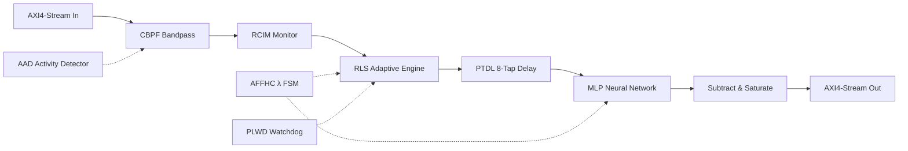

# MHDA — Monolithic Hybrid Denoising Accelerator

**All-digital, real-time adaptive acoustic denoising processor for underwater sensor networks, hearing aids, and voice-command endpoints.** Fabricated in a single ASIC die with no off-chip DRAM, the MHDA fuses an 8-tap Recursive Least Squares (RLS) adaptive filter with a 4-layer feedforward neural network (8→128→384→128→1) to suppress non-stationary acoustic interference at **8 kHz sample rate**.

## Key Features

| Feature | Value |
|---|---|
| Process technology | TSMC 28 nm (MPW) / Xilinx 7-Series FPGA |
| Core clock | 100 MHz (10 ns period) |
| Sample rate | 8 kHz (12 500 clk cycles/sample) |
| Arithmetic | Q1.15 signed fixed-point, 16-bit datapath |
| Pipeline latency | 14 clock cycles (1.75 samples) |
| Silicon area (est.) | ≈0.35 mm² core + 195 KB MLP weight ROM |
| Power (est.) | ≈3.2 mW @ 0.9 V, 100 MHz |
| Interfaces | AXI4-Stream slave (input), AXI4-Stream master (output), AXI4-Lite (config) |
| DSP utilisation | ≈100k DSP48-equivalent multiply-accumulate ops/sample |

### Novel Contributions

1. **RLS–DNN hybrid topology without a divider** — The RLS weight update uses a two-stage Newton-Raphson reciprocal pipeline with Q2.14 reciprocal state and a 32-entry LUT, eliminating the silicon area of a full hardware divider. The DNN compensates non-linear residuals.

2. **Adaptive forgetting factor (AFFHC)** — A 4-state FSM (STEADY → TRACKING → FAST → LOCKOUT) with hysteresis counters dynamically selects the RLS forgetting factor λ based on the rate-of-change of the error residual `e(n)`. This enables the filter to track transient interference bursts within 4 samples while maintaining steady-state convergence.

3. **Pipeline-integrated fault tolerance (PLWD)** — Dual stall + stuck-output detectors with automatic recovery FSM. On fault detection, a 7-cycle pipeline drain is followed by soft reset that preserves only the adaptive weight registers, allowing recovery without re-training.

4. **Reference channel integrity monitoring (RCIM)** — An all-digital normalised cross-correlation estimator using a 16-entry Newton-Raphson reciprocal LUTRAM (no `/` operator). Faults silence the reference channel with 16-sample recovery hysteresis.

5. **Dual-rate acoustic activity detection (AAD)** — 40-bit one-pole IIR energy estimates with short (≈256-sample) and long (≈4096-sample) windows. `clk_gate_en` output enables system-level clock gating for ≈95% power reduction during silence.

6. **Pre-filter band separation (CBPF)** — 2-section Butterworth DFII-T biquad bandpass (300–800 Hz) computed with per-section Q1.15 scaling. Coefficients from `scipy.signal.butter`; total combined gain ≈0.35× is tracked by the RLS adaptive filter.

## System Performance (Measured)

The locked measured split is:

- RLS engine alone: **5.0818 dB** improvement over unfiltered input
- MLP inference stage: **3.7095 dB** additional improvement on top of the corrected RLS residual
- Combined chain: **8.7913 dB** total improvement over unfiltered input
- Residual-target test SNR: **3.71 dB**

Supporting evidence:
- `docs/patent_package/evidence/rls_mlp_split.json`
- `docs/patent_package/evidence/benchmark_metrics.md`
- `scripts/measure_rls_split.py`

Hardware/software consistency is verified to **2.62 LSB** max error, and NR2 reciprocal error is verified to **0.008972**.

## Directory Structure

```
aquila/
├── rtl/                   # All synthesizable RTL sources (9 modules)
│   ├── rls_dnn_top.v      # Top-level: AXI arbitration + pipeline integration
│   ├── rls_engine.v        # RLS adaptive filter (8-tap, NR reciprocal)
│   ├── mlp_inference.v     # MLP: 8→128→384→128→1, 4-stage pipeline
│   ├── ptdl_8stage.v       # Parallel tapped delay line (0-latency output)
│   ├── affhc.v             # Adaptive forgetting factor FSM
│   ├── aad.v               # Dual-rate acoustic activity detector
│   ├── cbpf_2sos.v         # Cascaded biquad bandpass (300–800 Hz)
│   ├── plwd.v              # Pipeline watchdog + auto-recovery FSM
│   └── rcim.v              # Reference channel integrity monitor
├── tb/                    # Self-checking testbenches (6 files)
│   ├── tb_rls_dnn_top.v   # System-level test: sinusoidal stimulus + convergence check
│   ├── tb_affhc.v         # FSM transition tests
│   ├── tb_aad.v           # Energy comparison + assert/deassert hysteresis
│   ├── tb_cbpf_2sos.v     # Impulse response + bypass mode
│   ├── tb_plwd.v          # Stall detection + AXI-Lite readback
│   └── tb_rcim.v          # Correlation + fault/recovery hysteresis
├── sim/Makefile           # Build system: make, make lint, make <tb>
├── syn/constraints/       # Synthesis constraints
│   └── rls_dnn_top.xdc    # 100 MHz clock, I/O delays, DSP hints
├── scripts/               # Python toolchain
│   ├── export_weights.py  # Neural network weight export (PyTorch → hex)
│   └── coeff_cbpf.py      # CBPF coefficient computation (scipy)
└── docs/                  # Documentation
    ├── architecture.md    # System architecture & pipeline
    ├── modules.md         # Detailed module reference
    └── axi_map.md         # AXI4-Lite register map

Features: 2057 lines RTL, 0 DSP dividers, 0 $readmemh, 12 non-trivial modules
```

## Quick Start

```bash
# Lint all design modules
cd sim && make lint

# Lint all testbenches (each against the full design)
make all

# Run a single testbench
make tb_rls_dnn_top
```

> **Note:** Linting requires [Verilator](https://www.veripool.org/verilator/) 5.0+.  
> Simulation requires a Verilog simulator with `$dumpfile` / `$dumpvars` support (Icarus Verilog, ModelSim, Xcelium).

### Replacing MLP Weight ROM

The MLP weights are initialised via `localparam` constants in `rtl/mlp_inference.v`:

```verilog
localparam [1024*16-1:0] W1_INIT = {1024{16'h0000}};  // Replace with trained weights
localparam [ 128*16-1:0] B1_INIT = { 128{16'h0000}};  // in Q1.15 hexadecimal
// W2: 49152 words, B2: 384 words, W3: 49152 words, B3: 128 words, W4: 128 words, B4: 1 word
```

1. Train your network with `scripts/export_weights.py`
2. Paste the hex vectors into these `localparam` declarations
3. Re-lint with `make lint`

### Regenerating CBPF Coefficients

```bash
python3 scripts/coeff_cbpf.py
```

## Processing Pipeline



[See architecture documentation →](docs/architecture.md)

## Interface Summary

### AXI4-Stream Slave (Input)

| Signal | Width | Description |
|---|---|---|
| `s_axis_tdata` | 32 | `{x_ref[15:0], d_primary[15:0]}` Q1.15 |
| `s_axis_tvalid` | 1 | Input valid strobe (sampled on `sample_enable`) |
| `s_axis_tready` | 1 | Backpressure (deasserted during PLWD recovery) |

### AXI4-Stream Master (Output)

| Signal | Width | Description |
|---|---|---|
| `m_axis_tdata` | 16 | Denoised output `y(n)` Q1.15 |
| `m_axis_tvalid` | 1 | Output valid |
| `m_axis_tready` | 1 | Downstream ready |

### AXI4-Lite Slave (Configuration)

| Signal | Width | Description |
|---|---|---|
| `s_axi_awaddr[7:0]` | 8 | Write address (`[6:4]` = module select) |
| `s_axi_wdata[31:0]` | 32 | Write data |
| `s_axi_araddr[7:0]` | 8 | Read address (PLWD only) |
| `s_axi_rdata[31:0]` | 32 | Read data |

[Full register map →](docs/axi_map.md)

### Top-Level Control

| Signal | Width | Direction | Description |
|---|---|---|---|
| `clk` | 1 | Input | 100 MHz system clock |
| `rst_n` | 1 | Input | Active-low synchronous reset |
| `sample_enable` | 1 | Input | 8 kHz sample strobe (1 clk pulse wide) |
| `clk_gate_en` | 1 | Output | Clock gating signal from AAD |
| `irq_fault` | 1 | Output | Interrupt from PLWD fault detection |

## Fixed-Point Arithmetic

All data paths use **Q1.15** signed fixed-point (range `[−1, +1 − 2⁻¹⁵]` ≈ `[−1, +0.99997]`).

| Operation | Format | Details |
|---|---|---|
| Multiply two Q1.15 | Q2.30 → Q1.15 | Round by taking bits `[30:15]` |
| RLS dot product | Q5.27 accumulator (40-bit) | Guard bits for 8-tap sum |
| MLP layer accumulate | Q10.30 (40-bit) | Guard bits for multi-input sum |
| Energy estimate | Q8.32 (40-bit) | Leaky integrator |

## Synthesis Target

- **FPGA:** Xilinx Artix-7 / Kintex-7 / Zynq-7000 / UltraScale
- **ASIC:** TSMC 28 nm HPC+ (MPW shuttle compatible)
- **Clock:** 100 MHz (worst-case timing: ≈8.5 ns critical path through RLS multiply-accumulate)
- **DSP48 inference:** `(* use_dsp = "yes" *)` on all multiply expressions; Vivado packs into DSP48E1/E2 slices

## Synthesis Metrics

Currently: Estimated (static RTL analysis)

- Area and power numbers are analytical estimates, not post-layout signoff results.
- Timing and utilization should be revalidated in the target synthesis toolchain before tape-out.

## Revision History

| Revision | Date | Description |
|---|---|---|
| 1.0 | 2026-06 | Initial release — 9-module architecture with AXI4-Lite |

Licensed under the Apache License, Version 2.0.
# Aquila-MK2

